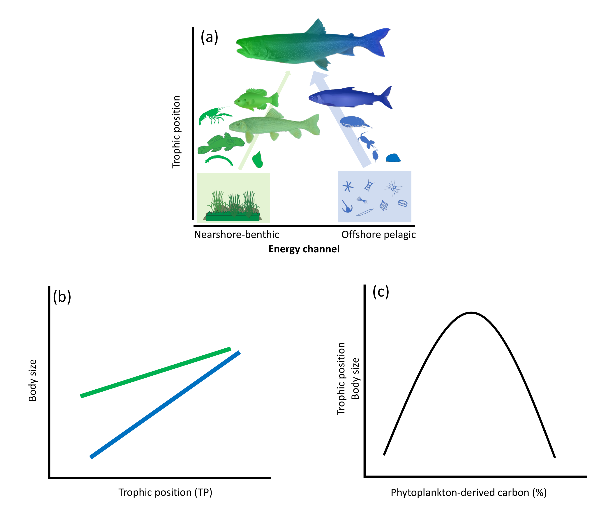

# Lake Michigan Food Web Architecture

R code accompanying:

Maitland et al. "Testing food web theory in a large lake: the role of body size in habitat coupling in Lake Michigan". Accepted at Ecology.

The landscape theory of food web architecture (LTFWA) describes relationships among body size, trophic position, mobility, and energy channels that serve to couple heterogeneous habitats, which in turn promotes long-term system stability. However, empirical tests of the LTFWA are rare and support differs among terrestrial, freshwater, and marine systems. Further, it is unclear if the theory applies in highly altered ecosystems dominated by introduced species such as the Laurentian Great Lakes. Here, we provide an empirical test of the LTFWA by relating body size, trophic position, and the coupling of different energy channels using stable isotope data from species throughout the Lake Michigan food web. We found that body size was positively related to trophic position, but for a given trophic position, organisms predominately supported by pelagic energy had smaller body sizes than organisms predominately supported by nearshore benthic energy. We also found a hump-shaped trophic relationship in the food web where there is a gradual increase in the coupling of pelagic and nearshore energy channels with larger body sizes as well as higher trophic positions. This highlights the important role of body size and connectivity among habitats in structuring food webs. However, important deviations from expectations are suggestive of how species introductions and other anthropogenic impacts can affect food web structure in large lakes. First, native top predators appear to be flexible couplers that may provide food web resilience, whereas introduced top predators may confer less stability when they specialize on a single energy pathway. Second, some smaller bodied prey fish and invertebrates, in addition to mobile predators, coupled energy from pelagic and nearshore energy channels, which suggests that some prey species may also be important integrators of energy pathways in the system. We conclude that patterns predicted by the LTFWA are present in the face of species introductions and other anthropogenic stressors to a degree, but time-series evaluations are needed to fully understand the mechanisms that promote stability. 

